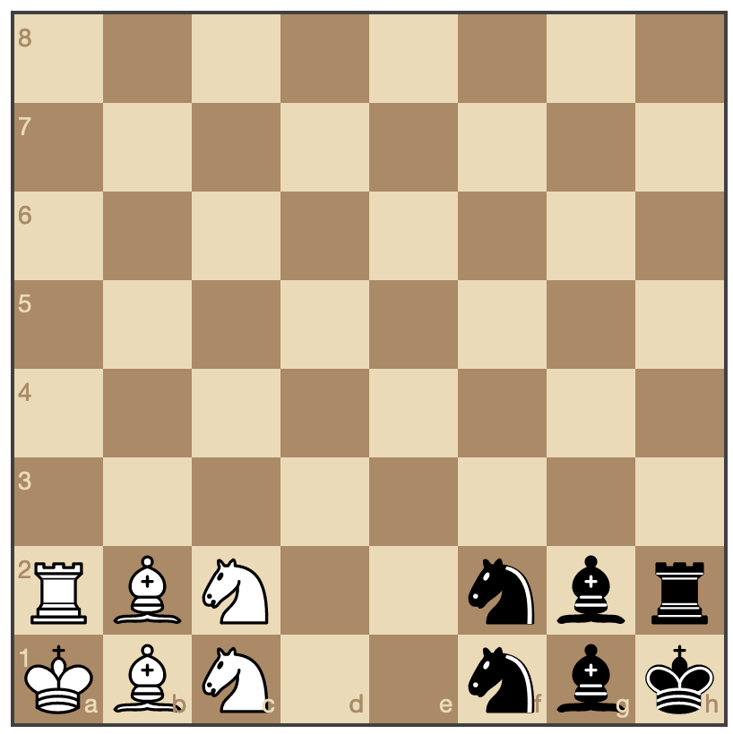

# chess_var

A variation of basic chess where the goal is to move your king to row 8 before your opponent does the same.

## The rules:

1. As in standard chess, white moves first.
2. The first player to move their king onto row 8 is the winner.
3. Pieces move and capture the same as in standard chess.
4. As in standard chess, a player is not allowed to expose their own king to check (including moving a piece that was blocking a check such that it no longer does).
5. Unlike standard chess, a player is not allowed to put the opponent's king in check (including moving a piece that was blocking a check such that it no longer does).

## The starting board:

